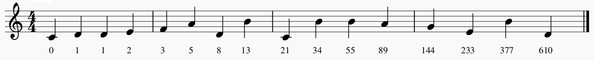

# fibonacci_song
Create a melody based on the Fibonacci sequence

[](http://badges.mit-license.org)

---

## Setup

 - This project requires the MIDIUtil library: https://pypi.org/project/MIDIUtil/
 - Download fibonacci_song.py
 - Use your favorite python console and see the example code below
 
---

## Example
The following example will create a midi file called "MyFirstFib.mid", containing the first 16 numbers of the Fibonacci sequence, mapped to the D Major diatonic scale.
```python

from fibonacci_song import FibSong, CHROMATIC, DIATONIC
MySong = FibSong()
MySong.midifilename = "MyFirstFib"
MySong.scale = 2  # change the scale to D Major
MySong.writeMidi(0, 1, 16)

```

---

## Usage
FibSong has various settings you can change:
- **scaletype** = DIATONIC or CHROMATIC (default DIATONIC)
- **scale**: an interger indicating which major scale to use, with scale = 0 for C, scale = 1 for C#, scale = 2 for D, etc (default 0)
- **midi_filename**: writeMIDI will create the file "midi_filename.mid" in the current folder (default "fibonaccisong")
- **tempo**: the tempo for the resulting midi file (default 90)

Along with the writiMIDI function, you can also call printNotes to print a list of the letter names to the console, or printNumbers to print the integers in the sequence.

writeMIDI, printNotes, and printNumbers all take the same three parameters:
- **x**: the first integer in the sequence (use 0 for the Fibonacci sequence)
- **y**: the second integer in the sequence (use 1 for the Fibonacci sequence)
- **count**: how many notes or numbers to return

If you're not sure how to read/play the resulting MIDI file, I suggest opening it using the free Musescore software (https://musescore.org/en).

## Notes
I use the name "Fibonacci", but this class can be used to create any sequence of numbers where: 
number[i] = number[i-2] + number[i-1]. 
This includes, but is not limited to, the Fibonacci and Lucas sequences.

The mapping from numbers to notes ignores octaves, putting all the notes between C4 and C5.
For the mathematically minded, it changes the number to base 7 (for diatonic) or base 12 (for chromatic) and then uses just the first digit.
